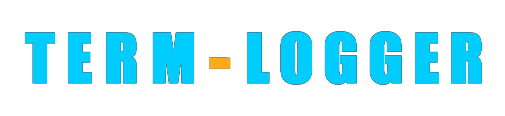

<div align="center">
  
</div>

<h1 align="center">TERM LOGGER</h1>
<p align="center">A simple & fast logger for better console formatted output!</p>

<p align="center">
  <a href="https://www.npmjs.com/package/term-logger">
    
  </a>
  <a href="https://www.npmjs.com/package/term-logger">
    
  </a>
  <a href="https://www.npmjs.com/package/term-logger">
    
  </a>
  <a href="https://www.npmjs.com/package/term-logger">
    
  </a>
</p>

<h1>Getting Started</h1>
<h2>Installation</h2>
<ul>
  <li>To install term-logger package simply run this command in cmd:</li>
</ul>

```
npm install term-logger@latest
```

<h2>Usage</h2>
<h4>Logger Options</h4>
<ul>
  <li>Import term-logger and start using any of the default loggers and colors.</li>
</ul>

<details>
  <summary>View all of the available loggers.</summary>

  <br />

- `error`
- `success`
- `warn`
- `waiting`
- `complete`
- `debug`
- `fatal`
- `info`
- `note`
- `pending`
- `start`
- `watch`
- `critical`
- `ready`
- `command`
- `event`
- `database`
- `shard`
- `cluster`
</details>

<br />

```js
const { Logger } = require("term-logger");

Logger.error(new Error("..."));
Logger.success("...");
// and 17 more logs...
```

<h4>TextColors Options</h4>

<details>
  <summary>View all of the available colors.</summary>

  <br />

- `red`
- `green`
- `yellow`
- `blue`
- `purple`
- `cyan`
- `white`
- `gray`
</details>

<br />

```js
const { TextColors } = require("term-logger");

TextColors.red("...");
TextColors.blue("...");
// and 6 more colors...
```

<h4>TextStyles Options</h4>

<details>
  <summary>View all of the available text styles.</summary>

  <br />

- `bold`
- `dim`
- `italic`
- `underline`
- `inverse`
- `hidden`
- `strikethrough`
- `visible`
</details>

<br />

```js
const { TextStyles } = require("term-logger");

TextStyles.italic("...");
TextStyles.underline("...");
// and 7 more text styles...
```

<h4>BgColors Options</h4>

<details>
  <summary>View all of the available options.</summary>

  <br />

- `red`
- `green`
- `yellow`
- `blue`
- `purple`
- `cyan`
- `white`
- `gray`
</details>

<br />

```js
const { BgColors } = require("term-logger");

BgColors.red("...");
BgColors.blue("...");
// and 6 more colors...
```

<h4>BrightColors Options</h4>

<details>
  <summary>View all of the available colors.</summary>

  <br />

- `red`
- `green`
- `yellow`
- `blue`
- `purple`
- `cyan`
- `white`
</details>

<br />

```js
const { BgColors } = require("term-logger");

BgColors.red("...");
BgColors.blue("...");
// and 6 more colors...
```

<h2>Contributors</h2>
<div align="left">
  <a href="https://samculo.com">
    
  </a>
  <br>
</div>

<h2>Projects that use term-logger</h2>
<p>Some notable projects that use <b>term-logger</b> include:</p>

- [Robly](https://roblybot.xyz)
- [Nero Bot](https://nerobot.eu)
- [Note Bot](https://github.com/lassejlv/note-bot)
- [Movie Swiper](https://www.movieswiper.xyz/)
- [Cosmo](https://cosmobot.app)

Do you use a term-logger? Join our [Discord Server](https://discord.com/invite/UdKSrxBXyd) and let us know!

<h2>Do you have any issues?</h2>
<p>
  If you have any issues don't hesitate to report it via
  <a href="https://github.com/devdeem/term-logger/issues">GitHub Issues</a>.
</p>

<h2>Sponsor Us ❤️</h2>
<p>
  Do you use <b>Term Logger</b> and are you satisfied?<br>You can support us with a one-time donation to help us improve our
  work <a href="https://ko-fi.com/deemdev">here</a>.
</p>

<footer>> Developed by <b>@deemdev</b> with ❤️</footer>
